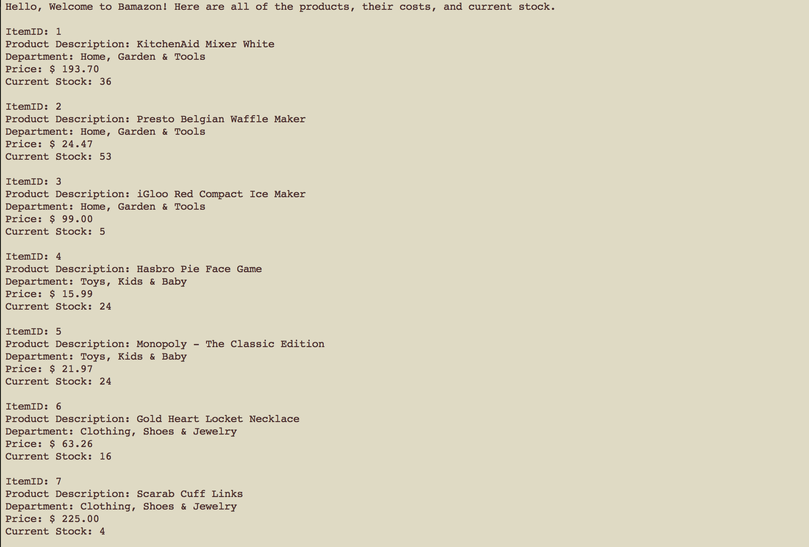
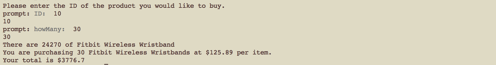
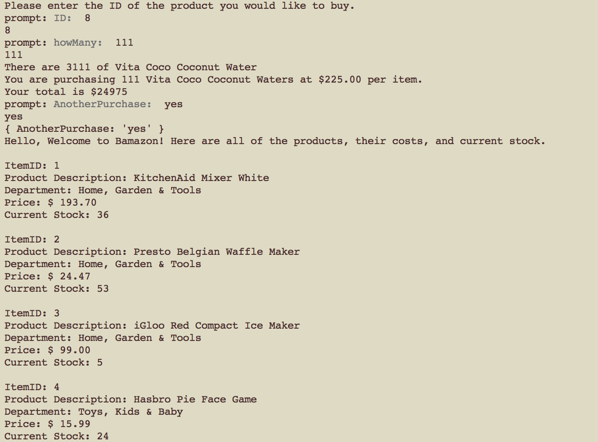

* The app asks the following things from the user.

	1. product ID
	2. the amount the user wants to purchase

* The app will display the stock before your purchase, what you are buying, how many, and the unit cost.
* Then it will display the total cost and ask if you want to purchase another item. 

